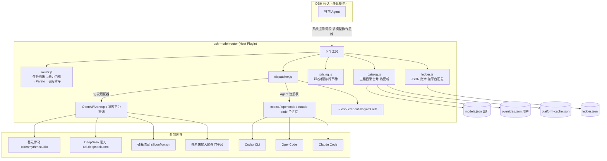
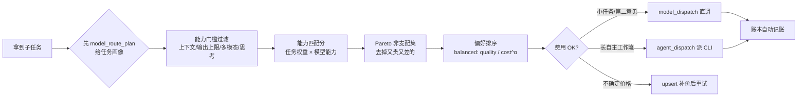
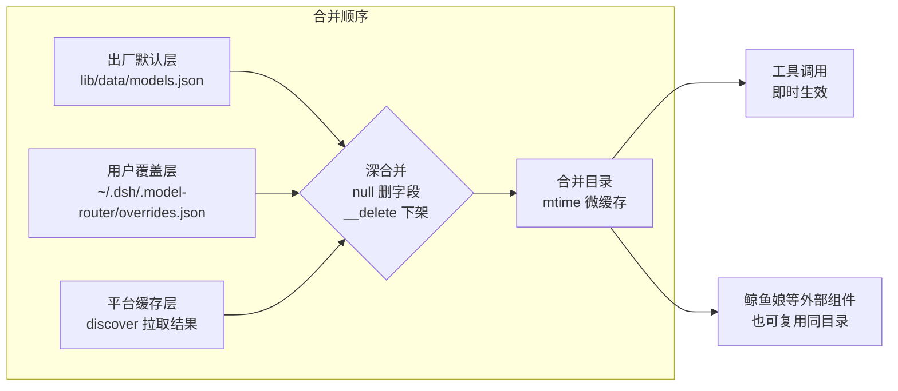
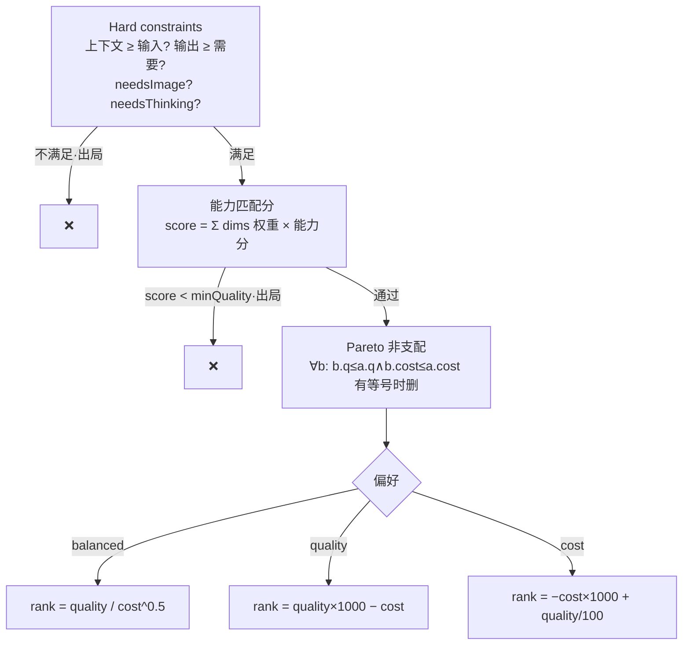

# 🐋 dsh-model-router — 模型调度中枢

> **Model Routing Hub for DeepSeek Harness (DSH)** — 让 DSH 会话中的任意模型都能按任务需求**跨平台调度其他模型与 Agent CLI**，并实时感知每一分钱花在哪。

一个插件 = 模型超市 + 比价引擎 + 调度总台 + 自动账本。当前会话用什么模型都行——它自己就能“叫别的模型来干活”。

---

## ✨ 特性一览

| 能力 | 说明 |
|---|---|
| 🔀 **任务感知路由** | 六维能力画像（code/reasoning/writing/knowledge/multimodal/speed）× 任务需求权重 → Pareto 非支配集 → 按性价比/质量/成本排序 |
| 🌍 **跨平台直调** | OpenAI / Anthropic 双协议适配器，直打平台 `/chat/completions`，不经主会话上下文（不嵌套计费） |
| 🤖 **Agent CLI 调度** | 声明式适配器注册表：**codex / opencode / claude-code** 预置，加新 CLI = 加一段 JSON，零代码 |
| 💰 **实时费用确认** | 峰谷计价（DeepSeek 官方双轨）、促销价标注、跨币种换算（默认 CNY，USD=7.1 可配）、缓存命中拆账 |
| 📒 **自动账本** | 每次调用记录 tokens × 单价（区分 cache hit/miss），按平台/模型滚动汇总，`model_ledger` 一键查询 |
| 🔄 **三层目录热更新** | 出厂默认层 / 用户覆盖层 / 平台缓存层，改文件即生效；`discover` 可拉真实模型清单并自动建条目 |

---

## 🧭 架构总览



### 调度管线



### 三层目录（更新机制的心脏）



---

## 🚀 快速开始（DSH 环境）

### 安装

```bash
# 通过 dsh-super-injector 注入（无需重启）
dev_inject_plugin /path/to/dsh-model-router
# 或热重载更新
dev_reload_package dsh-model-router
```

### 典型用法

```text
你: 把这个仓库的依赖升级一遍并说明风险

Agent 内部决策流程:
1. model_route_plan
   task="升级依赖并审查破坏性变更"
   code=1.0 reasoning=0.8 contextTokens=150000 minQuality=85
   → 候选: deepseek-v4-flash@硅基流动 ¥0.30/会话 | deepseek-v4-pro@基元律动 ¥3.15
2. 主线（轻活）自留，重活 dispatch：
   model_dispatch platform=siliconflow model=deepseek-ai/DeepSeek-V4-Flash ...
3. 需要跑完整测试/批量改文件:
   agent_dispatch agent=codex task="...完整任务指令..."
4. 收工查账: model_ledger
```

---

## 🛠️ 工具参考

| 工具 | 作用 | 关键参数 |
|---|---|---|
| `model_route_plan` | 任务画像 → 跨平台候选排序（价格/置信度/理由） | task*, code/reasoning/writing/knowledge/multimodal/speed 权重, minQuality, contextTokens, needsImage, needsThinking, preference=balanced\|quality\|cost |
| `model_dispatch` | 直调任意平台模型（自动记账） | platform*, model*, prompt 或 messages, maxTokens, thinking=auto\|off\|on, timeoutMs |
| `agent_dispatch` | 派外部 Agent CLI 干活 | agent=codex\|opencode\|claude-code, task*, sandbox=read-only\|workspace-write\|danger-full-access, model, timeoutMs |
| `model_ledger` | 费用账本汇总 | since (ISO 时间) |
| `model_catalog_manage` | 目录管理：show/upsert/remove/discover | action*, target=model\|platform\|agent, id, data, adopt |

---

## 💾 目录数据模型（节选）

```jsonc
// lib/data/models.json —— 出厂默认层
{
  "version": "2026-09-09.1",
  "platforms": {
    "deepseek-official": {
      "displayName": "DeepSeek 官方",
      "baseURL": "https://api.deepseek.com",
      "credentialRef": "DEEPSEEK_API_KEY",
      "currency": "USD",
      "timeVarying": { "peakUtcHourRanges": [[1,4],[6,10]], "weekdaysOnly": true }
    }
  },
  "models": [
    {
      "id": "deepseek-v4-flash",
      "contextWindow": 1000000, "maxTokens": 384000,
      "capabilities": { "code": 90, "reasoning": 88, "writing": 82, "knowledge": 86, "multimodal": 0, "speed": 88 },
      "prices": {
        "deepseek-official": {
          "modelId": "deepseek-v4-flash",
          "cacheMissInput": { "offPeak": 0.22, "peak": 0.44 },
          "output": { "offPeak": 0.66, "peak": 1.32 },
          "confidence": "verified", "sourceUrl": "https://api-docs.deepseek.com/quick_start/pricing"
        }
      }
    }
  ]
}
```

> **价格数据三重置信度纪律**：`verified`（官网当日核实）/ `reported`（权威媒体比价）/ `estimated`（推算）。能力分同样标注 `benchmarked` / `estimated`——宁缺毋滥，绝不假装精确。

---

## 🔄 更新机制（维护者指南）

### 加一个模型（零代码，热生效）

```text
model_catalog_manage upsert target=model id=gpt-5.5
data={"vendor":"OpenAI","contextWindow":400000,"maxTokens":128000,
      "capabilities":{...六维...},
      "prices":{"openrouter":{"modelId":"openai/gpt-5.5","input":1.75,"output":14.0}}}
```

### 加一个平台（零代码）

```text
model_catalog_manage upsert target=platform id=my-new-gw
data={"displayName":"我的网关","baseURL":"https://gw.example.com/v1",
      "credentialRef":"MY_GW_API_KEY","currency":"CNY"}
# 凭证写入 ~/.dsh/.credentials.yaml 的 refs 段即可
```

### 加一个 Agent CLI（零代码——适配器注册表）

```text
model_catalog_manage upsert target=agent id=my-agent
data={"displayName":"My Agent CLI","command":["my-agent","run"],
      "promptMode":"arg","parseProfile":"plain",
      "sandboxMap":{"read-only":"read-only","workspace-write":"workspace-write","danger-full-access":"danger-full-access"}}
```

`parseProfile` 支持三种输出解析：`plain`（全文即结果）/ `jsonl-codex`（codex 事件流）/ `json-envelope`（claude 单 JSON 信封）。

### 核对平台真实模型

```text
model_catalog_manage discover platform=tokenrhythm adopt=true
# adopt=true：清单里没有目录条目的模型自动建骨架（价格 unknown，随后逐个补价）
```

### 改出厂默认层（大版本）

直接编辑 `lib/data/models.json` 后 `dev_reload_package`。**纪律：每次价格改动必须带 `confidence` 与 `sourceUrl`**。

---

## 🎯 任务画像：不填也能用（四层回退）

调用方（agent）可以懒：不声明六维权重的场景按以下顺序解析，全程可解释：

```text
显式六维权重 (code=1.0 …)  >  profile 预设 (code/reasoning/writing/knowledge/multimodal/chat/general)
                         >  任务文本自动分类（关键词计数，含歧义收敛到 general）
                         >  general 通用画像（最终兜底）
```

`model_route_plan` 输出会标注画像来源与依据（例：`按任务文本自动分类 → code（依据: code×3）`），
避免“黑盒画像”影响路由可审计性。

## 📊 能力分的基准纪律（路由的心脏）

- 六维能力分是路由输入的核心——**宁缺毋假**：无公开基准支撑的维度一律标
  `capabilityConfidence: estimated`（分层估计，随新证据在覆盖层精化），绝不臆造 benchmark 数字。
- 有出处的数据走 `benchmarkRefs: [{name, score, sourceUrl}]`（当前锚点：DeepSeek 家族
  SWE-Bench、GLM-5.1 SWE-Bench Pro 等）。
- 定期自查缺口：`model_catalog_manage action=bench-audit`（列出 estimated 模型、
  有 refs 的模型与缺价模型，并给出回填规范）。
- 建议闭环：接入 dsh-quality-gauge 等实测工具把「本机实测分数」回填为用户覆盖层。

## 📐 路由算法方法论



成本估算按**典型会话**（20 万输入 / 5 万输出 tokens）折算，跨币种统一换算后参与排序。

### 参考文献

- **FrugalGPT** — Chen, Zaharia & Zou (2023). *FrugalGPT: How to Use Large Language Models While Reducing Cost and Improving Performance*. LLM 级联思想（先便宜后升级）是本插件 cost-aware selection 的理论源头。
- **RouteLLM** — Ong et al. *RouteLLM: Learning to Route LLMs with Preference Data*（LMSYS）。质量-成本权衡的路由学习框架；本插件的“能力门槛 + 显式任务画像”是其在无标注数据场景下的可解释简化。
- **Dynamic Model Routing and Cascading for Efficient LLM Inference: A Survey**（arXiv:2603.04445）。三阶段（pre-router → quality estimator → escalation policy）设计空间的系统梳理。
- **LiteLLM**（github.com/BerriAI/litellm）— 工程参考：cost-based-routing、cooldown、fallback 等生产实践。

### 与训练式路由器的区别（设计取舍）

训练式 router（RouteLLM 等）需要大量偏好标注数据才能训练分类器；本插件面向**单机单用户**场景，选择让调用方（agent）显式声明任务画像（六维权重），配合带置信度的目录——透明、可解释、可审计，数据缺失时优雅降级而不是瞎猜。

---

## 📒 账本

```text
model_ledger
→ 按平台: tokenrhythm: 12 次｜¥0.85｜…；agent:codex: 3 次｜tokens 记录（不折价）
```

存储：`~/.dsh/.model-router/ledger.json`（滚动保留最近 2000 条）。Codex/OpenCode 等外部 agent 只记 tokens 不折价（它们走各自的平台账户）。

---

## 🤝 生态协同

- **dsh-whale-widget**（鲸鱼娘挂件）会**复用本插件的目录**做多平台计费与余额着色——两个插件共享同一份价格真相。
- 与 dsh-safety 审批流协作：dispatch 费用超阈值会先确认再执行（可配置）。

## ⚖️ 许可

MIT License — 自由使用、修改、分发。

## 📌 Roadmap / 已知限制

- [ ] 能力分数当前为分层估计，欢迎 PR 用实测基准数据精化（字段：`capabilityConfidence: benchmarked` + `benchmarkRefs`）
- [ ] `discover` 对非 OpenAI 兼容协议的平台不可用
- [ ] Anthropic 协议直调已适配但未在生产平台实跑（无 key），欢迎 issue 反馈
- [ ] 中文注释为主，欢迎贡献英文翻译
